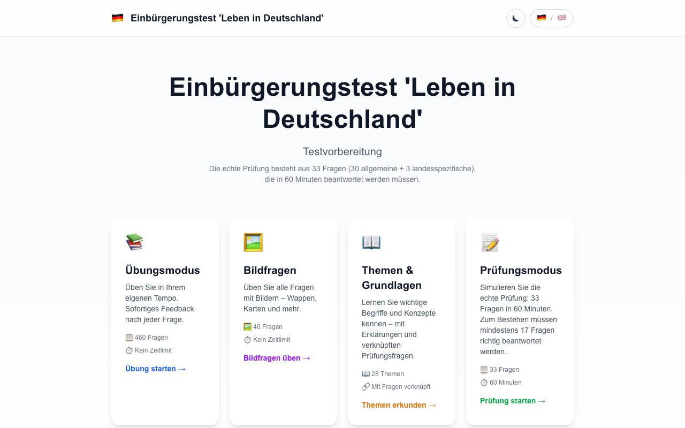
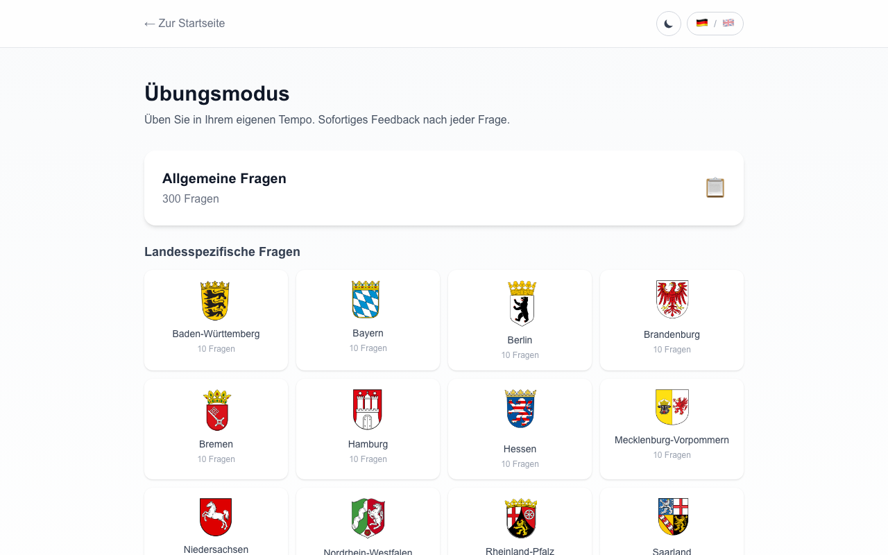
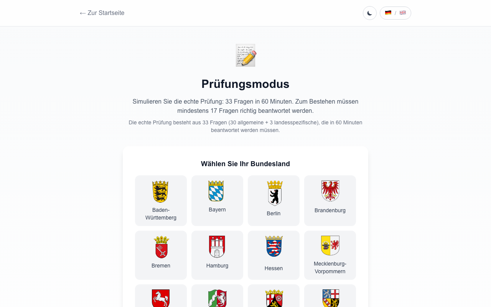
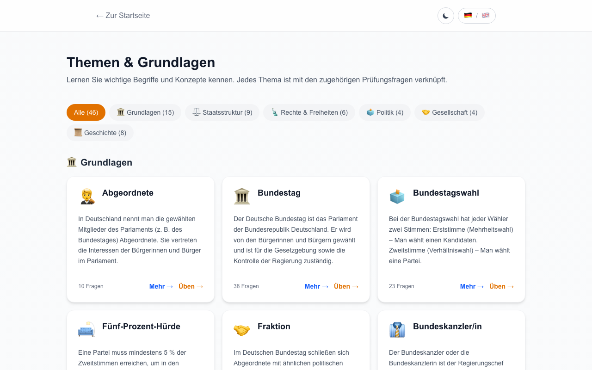
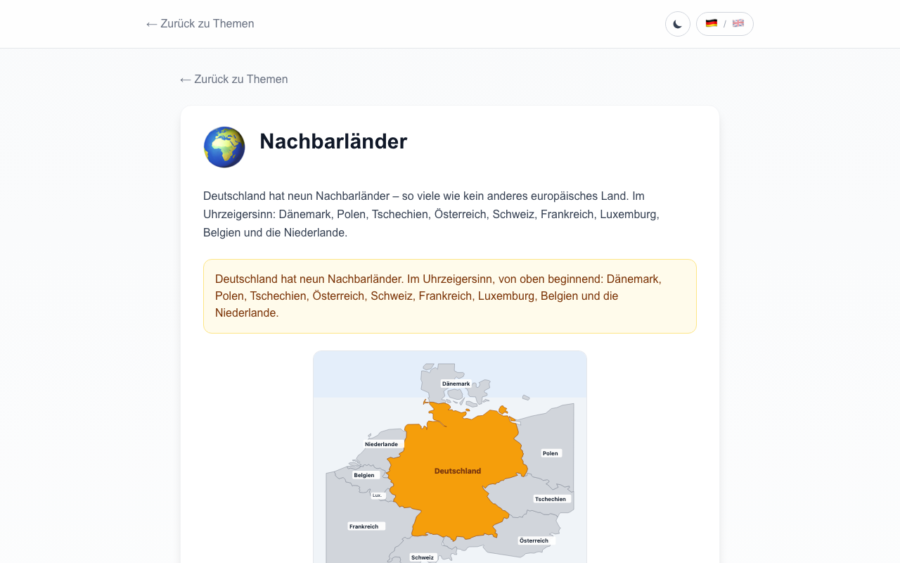
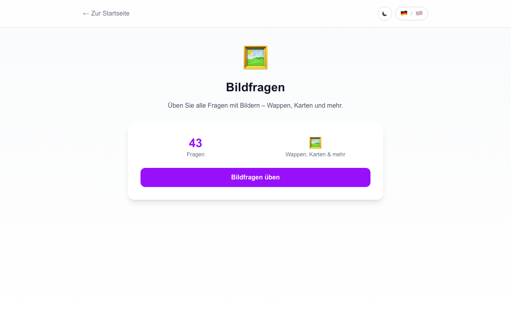

# 🇩🇪 Leben in Deutschland – Einbürgerungstest Trainer

A modern, interactive web app for preparing for the German citizenship test (*Einbürgerungstest / "Leben in Deutschland"*). Built with Next.js and deployed as a static site on GitHub Pages.

**[Live Demo →](https://ranjigt.github.io/lid-trainer/)**

---

## Features

- **460 Questions** — All 300 general questions + 160 state-specific questions (10 per Bundesland), sourced from the official BAMF catalogue
- **Practice Mode** — Work through all questions at your own pace with instant feedback
- **Exam Simulation** — Realistic 33-question exam with 60-minute countdown timer, just like the real test
- **Image Questions** — Dedicated mode for the ~40 image-based questions (coats of arms, maps, etc.)
- **46 Learning Topics** — Organized across 6 categories (Grundlagen, Staatsstruktur, Rechte & Freiheiten, Politik, Gesellschaft, Geschichte) with illustrated explanations, key facts, and related practice questions
- **Bilingual** — Full German and English UI
- **Dark Mode** — Automatic and manual theme switching
- **Coat of Arms** — State coat of arms on selection buttons for a visual learning experience
- **Fully Offline** — Static export, works without a server

## Screenshots

### Home


### Practice Mode


### Exam Simulation


### Topics Overview


### Topic Detail


### Image Questions


## Getting Started

### Prerequisites

- Node.js 18+
- npm, yarn, pnpm, or bun

### Installation

```bash
cd app
npm install
```

### Development

```bash
npm run dev
```

Open [http://localhost:3000/lid-trainer](http://localhost:3000/lid-trainer)

### Build

```bash
npm run build
```

The static export is generated in `app/out/`.

## Project Structure

```
app/
├── public/
│   └── images/
│       ├── chancellors/       # Chancellor portraits
│       ├── coats-of-arms/     # 16 state coat of arms (transparent PNGs)
│       ├── presidents/        # President portraits
│       ├── questions/         # Question images
│       └── topics/            # Topic illustration SVGs
│           ├── bundeskabinett/
│           ├── ehrenamt/
│           ├── erziehung/
│           ├── fraktion/
│           └── ...
├── src/
│   ├── app/
│   │   ├── page.tsx           # Landing page
│   │   ├── practice/          # Practice mode
│   │   ├── exam/              # Exam simulation
│   │   ├── images/            # Image questions mode
│   │   └── topics/            # Topic browser & practice
│   ├── components/
│   │   ├── QuestionCard.tsx   # Question display & answer logic
│   │   ├── Results.tsx        # Score & review screen
│   │   ├── TopicCard.tsx      # Topic grid cards
│   │   ├── TopicDetail.tsx    # Topic detail with galleries
│   │   ├── Timer.tsx          # Countdown timer
│   │   ├── LanguageToggle.tsx # DE/EN switcher
│   │   └── ThemeToggle.tsx    # Light/Dark mode
│   ├── data/
│   │   ├── questions.json     # All 460 questions
│   │   └── topics.ts          # 46 topics with details
│   └── lib/
│       ├── i18n.ts            # Translation strings
│       ├── types.ts           # TypeScript interfaces
│       └── basePath.ts        # Asset path helper
```

## Tech Stack

- **Framework:** [Next.js](https://nextjs.org/) 16 (App Router, static export)
- **Styling:** [Tailwind CSS](https://tailwindcss.com/) 4
- **Language:** TypeScript
- **Deployment:** GitHub Pages (static HTML)

## About the Test

The *Einbürgerungstest* ("Life in Germany" test) is required for German citizenship. Key facts:

| | |
|---|---|
| **Questions** | 33 (30 general + 3 state-specific) |
| **Time** | 60 minutes |
| **Pass mark** | 17 correct (≈52%) |
| **Format** | Multiple choice (4 options each) |
| **Source** | [BAMF Gesamtfragenkatalog](https://www.bamf.de) |

## Data Sources

- Questions from the official BAMF question catalogue (as of 07.05.2025)
- Coat of arms extracted from official question images
- Topic illustrations created as custom SVGs

## License

This project is for educational purposes. Question content is sourced from publicly available BAMF materials.

---

*Made with ❤️ to help people prepare for life in Germany.*